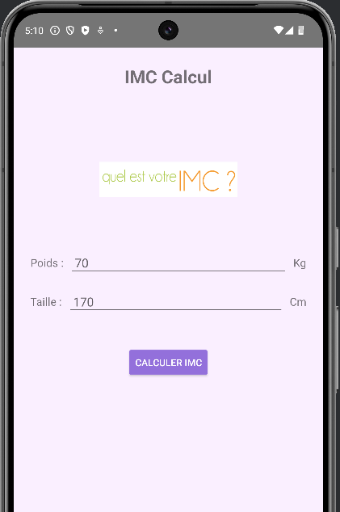
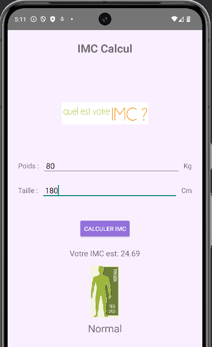
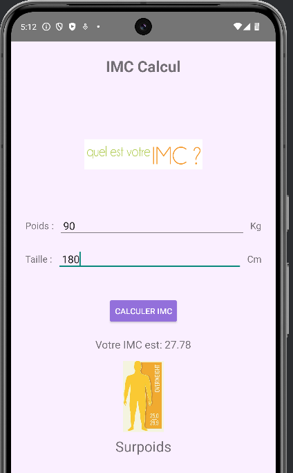
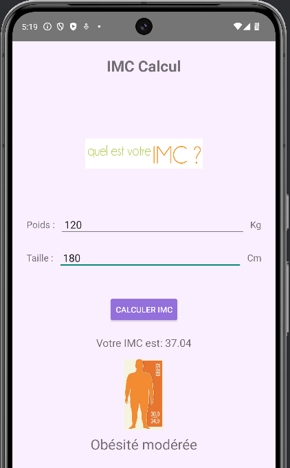
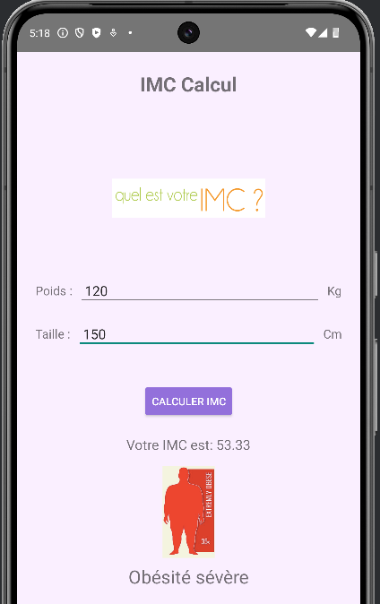

# Application IMC (Indice de Masse Corporelle) - Android

Une application Android simple pour calculer l'Indice de Masse Corporelle (IMC) d'un utilisateur et afficher la catégorie de poids correspondante.

## Table des matières
* [Fonctionnalités](#fonctionnalités)
* [Captures d'écran](#captures-décran)
* [Technologies utilisées](#technologies-utilisées)
* [Installation](#installation)
* [Comment utiliser](#comment-utiliser)
* [Auteur](#auteur)
* [Licence](#licence) (Optionnel)

## Fonctionnalités

*   Saisie du poids (en kilogrammes) et de la taille (en centimètres) de l'utilisateur.
*   Calcul de l'IMC basé sur les valeurs saisies.
*   Affichage de la valeur de l'IMC calculée.
*   Affichage de la catégorie de poids correspondante (Maigreur, Normal, Surpoids, Obésité modérée, Obésité sévère).
*   Affichage d'une image illustrative pour chaque catégorie de poids.
*   Messages d'erreur pour les saisies invalides.

## Captures d'écran

### Écran principal / Saisie des données

*Description : L'utilisateur saisit son poids et sa taille.*

### Résultat IMC Normal

*Description : Exemple de résultat pour un IMC dans la catégorie "Normal".*

### Résultat IMC Surpoids

*Description : Exemple de résultat pour un IMC dans la catégorie "Surpoids".*

### Résultat IMC Obésité modéré

*Description : Exemple de résultat pour une des catégories "Obésité modérée".*

### Résultat IMC Obésité sévère

*Description : Exemple de résultat pour une des catégories "Obésité sévère".*

## Technologies utilisées

*   **Langage :** Kotlin
*   **Architecture :** Utilisation de `ComponentActivity` (ou `AppCompatActivity`)
*   **Interface utilisateur :** XML Layouts avec `ConstraintLayout`
*   **Accès aux vues :** `findViewById` (ou ViewBinding si vous l'avez implémenté)
*   **IDE :** Android Studio
*   **Gradle** pour la gestion des dépendances et le build.

    